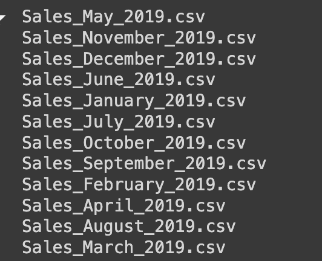
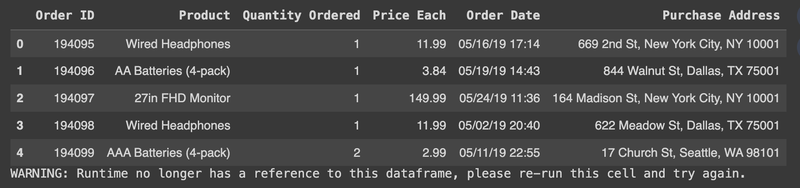
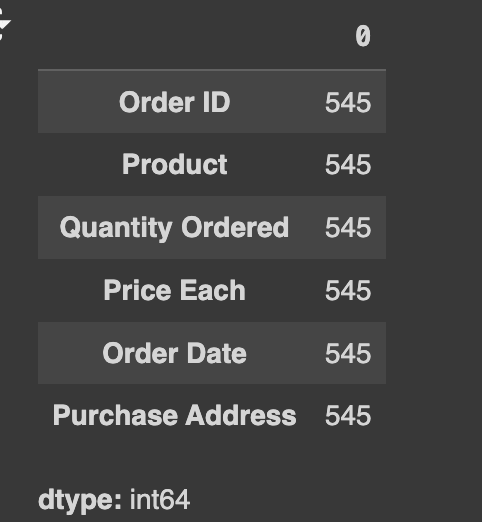
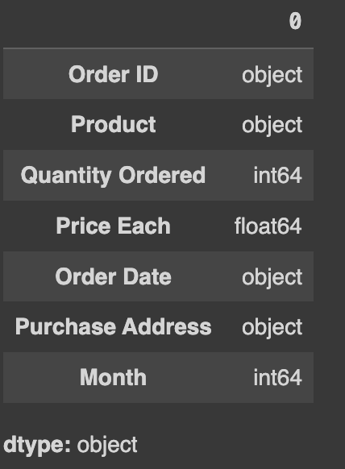
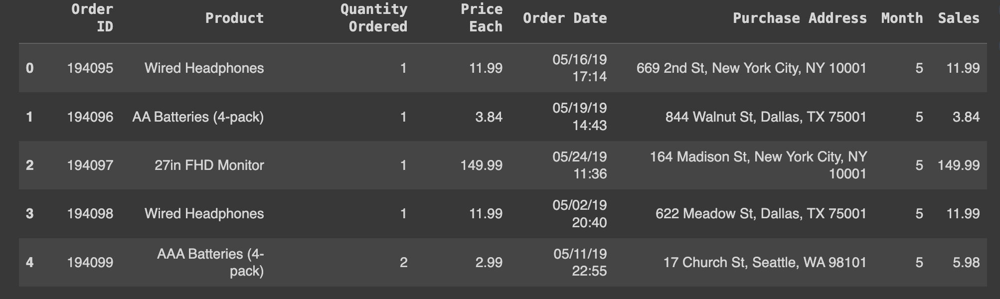
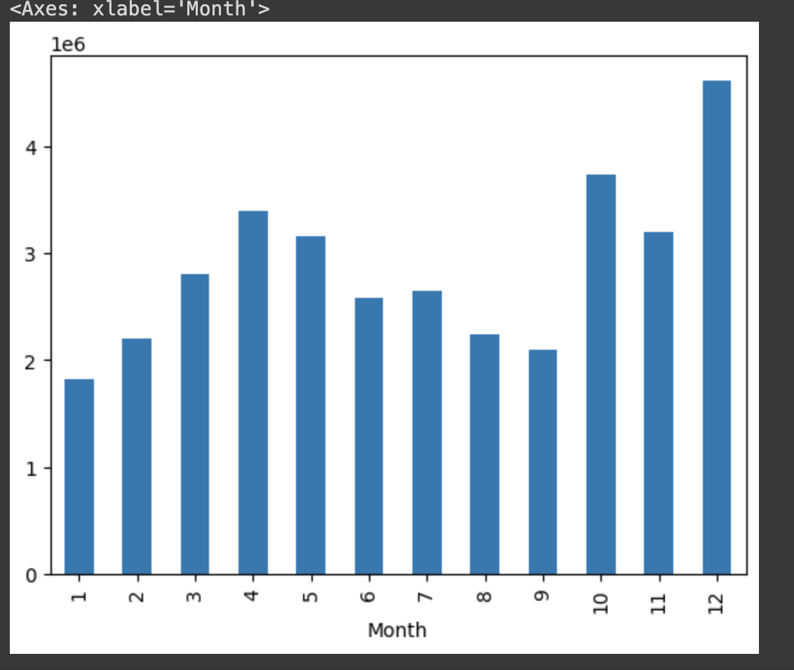
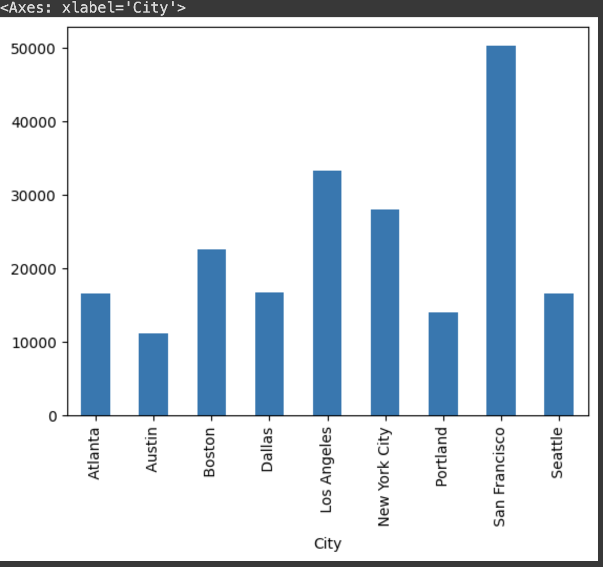
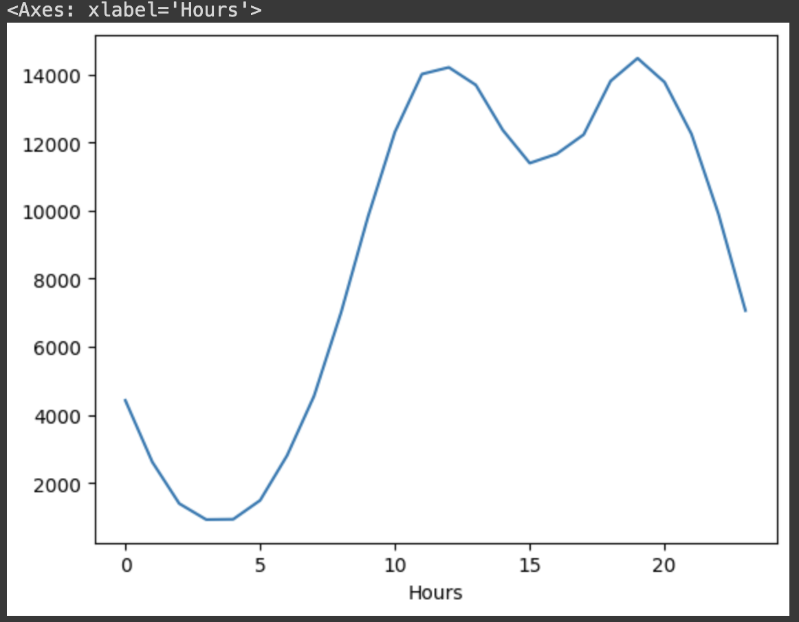
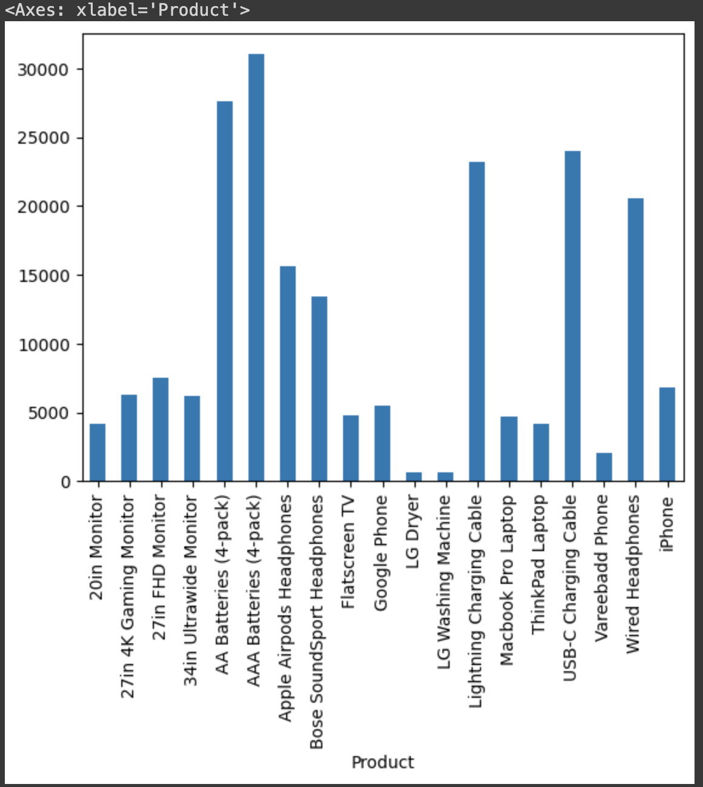

# Project Report Sales_2019

# Developing a visualization report by combining Python and Power BI for our electronics store.
## Data Clining using Python 
### installing Dependencies
```Python
   import pandas as pd
import numpy as np
import os
import matplotlib.pyplot as plt
import seaborn as sns
```
### Download dataset
```Python
path='/content/datas'
files = [file for file in os.listdir(path)]
for file in files:
  print(file)
```
output

### Get a datasets from the download dataset
```Python
my_datas = pd.DataFrame()
for file in files:
    current_data = pd.read_csv(path + '/' + file)
    my_datas = pd.concat([my_datas, current_data], ignore_index=True)
```
Get a five first row in own dataset
```Python
my_datas.head(5)
```

|   | Order ID	| Product               | Quantity Ordered | Price Each | Order Date      | Purchase Address                          |
|--:|:--------:| ---------------------:| ----------------:| ----------:| ---------------:| -----------------------------------------:|
| 1 | 194095   | Wired Headphones      |                1 |     11.99  |  05/16/19 17:14 |   669 2nd St, New York City, NY 10001     |
| 2 | 194096   | AA Batteries (4-pack) |                1 |     3.84   |  05/19/19 14:43 |   844 Walnut St, Dallas, TX 75001         |
| 3 | 194097   |    27in FHD Monitor   |                1 |     149.99 |  05/24/19 11:36 |   164 Madison St, New York City, NY 10001 |
| 4 | 194098   |   Wired Headphones    |                1 |     11.99  |  05/02/19 20:40 |   622 Meadow St, Dallas, TX 75001         |
| 5 | 194099   |AAA Batteries (4-pack) |                2 |     2.99   |  05/11/19 22:55 |   17 Church St, Seattle, WA 98101         |
Dimensions of data structures
```Python
my_datas.shape
```
Find a missing values
```Python
my_datas.isnull().sum()
```
Output

Drop all missing values in own dataset
```Python
my_datas.dropna(how='all', inplace=True)
my_datas.shape
```
check the type of dataset
```Python
my_datas.dtypes
```
Let's add a column named 'Month' to extract the months.
```Python
def month(x):
  return x.split('/')[0]

my_datas['Month']=my_datas['Order Date'].apply(month)
my_datas.head(5)
```
Using 'unique()' method to find the unique values DataFrame column 'Month'.
```Python
my_datas['Month'].unique()
```

Using a filter for constisting data
```Python
my_datas=my_datas[my_datas['Month']!= 'Order Date']
```
Change the data types of the columns
```Python
my_datas['Month'] = my_datas['Month'].astype(int)
my_datas['Quantity Ordered'] = my_datas['Quantity Ordered'].astype(int)
my_datas['Price Each'] = my_datas['Price Each'].astype(float)
my_datas.dtypes
```

Creating a column named 'Sales' to calculate the sales.
```Python
my_datas['Sales'] = my_datas['Quantity Ordered'] * my_datas['Price Each']
my_datas.head(5)
```

### What is the month during which we achieved the highest revenue?
```Python
my_datas.groupby('Month')['Sales'].sum().plot.bar()
```

### In which city did we record the highest number of orders?
```Python
def city(x):
  return x.split(',')[1]

my_datas['City'] = my_datas['Purchase Address'].apply(city)
my_datas.groupby('City')['Quantity Ordered'].sum().plot.bar()
```

### When is the best time to run an advertising campaign to increase sales?
```Python
my_datas['Hours'] = pd.to_datetime(my_datas['Order Date']).dt.hour
hours =[]
keys =[]
for key, hour in my_datas.groupby('Hours'):
  keys.append(key)
  hours.append(len(hour))
my_datas.groupby('Hours')['Quantity Ordered'].sum().plot()
```

```Python
my_datas.groupby('Product')['Quantity Ordered'].sum().plot.bar()
```

# Creating a dashboard

